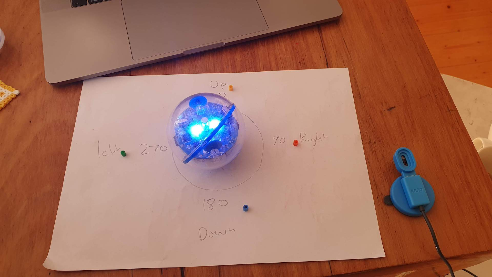

# Moonhack 2020!

Move your Sphero with only your hand motions!  
Change the colour and direction every time you swipe.


## For this moonhack you need:  
* Raspberry Pi 3 or higher. 
* Kano motion sensor   
* Sphero Sprk+ 




## Setup
```
wget https://github.com/KanoComputing/community-sdk/archive/python.zip -O community-sdk.zip.
unzip -j community-sdk.zip 'community-sdk-python/communitysdk/*' -d ./communitysdk. 
sudo pip3 install sphero_sprk
sudo python3 kano-sphero.py
```

## Projects we used
* <https://github.com/CMU-TBD/sphero_sprk>
* <https://github.com/KanoComputing/community-sdk>

## Common Errors
The Sphero needs to be really close to start pairing. If it isn't it may pickup something else in your house that is closer!
